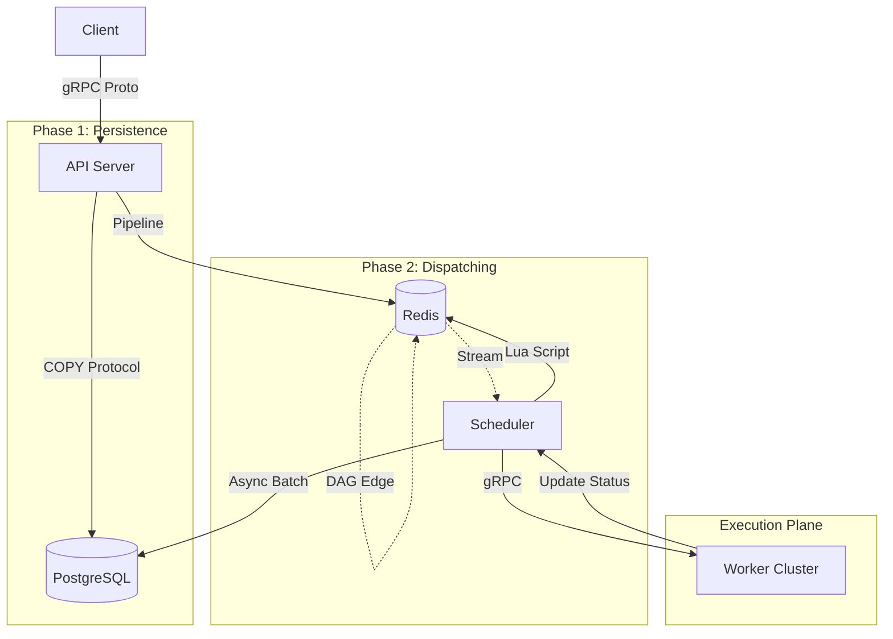
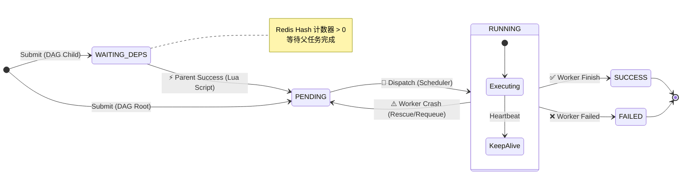

# **Distributed Task Scheduling System (DTS)**

    

一个基于 **C++20**、**Redis Stream** 与 **PostgreSQL** 的高性能分布式任务调度系统。支持复杂的 DAG 依赖编排、**亚毫秒级**任务流转与故障自愈。

## **📖 项目简介 (Introduction)**

**DTS (Distributed Task Scheduling System)** 是一个高性能的分布式调度平台原型，旨在解决大规模离线任务调度中的复杂依赖管理与高可用问题。

系统采用 **Claim Check (寄存票模式)** 与 **Split-Phase (分阶段提交)** 架构，彻底解耦了任务提交与调度执行。核心调度逻辑下沉至 **Redis Lua** 脚本，实现了原子性的 DAG 依赖驱动。在保证数据最终一致性 (Write-Behind) 的前提下，系统接近 **物理硬件的 IOPS 极限**。

## **✨ 核心特性 (Key Features)**

* **极致性能架构**:
    * **Claim Check Pattern**: Redis Stream 仅传输轻量级 `TaskID` 和 `JobID` 凭证，业务负载 (Payload) 存入 Redis KV，极大提升吞吐量。
    * **Split-Phase Submission**: 采用 **"Commit-then-Publish"** 策略，先确保 PostgreSQL 落盘，再通过 **Redis Pipeline (1-RTT)** 极速分发，兼顾数据安全与速度。
    * **Zero-Copy Pass-through**: API 层采用 Protobuf + String 透传策略，避免了昂贵的 JSON 解析与 DOM 构建开销。

* **Redis 驱动的 DAG 引擎**:
    * **Lua 原子调度**: 任务完成后的依赖检查与下游触发完全在 Redis 端原子执行，消除 C++ 端并发竞争，调度延迟 **< 1ms**。
    * **Stream 消费**: Scheduler 采用 `XREADGROUP` + `BLOCK` 模式，实现事件驱动的毫秒级响应。

* **高可用与自愈 (Robustness)**:
    * **Write-Behind Persistence**: 任务状态先更新 Redis，再通过 `DbBatcher` 异步批量刷入 DB，平滑数据库压力。
    * **Optimistic Pre-booking**: 调度器在内存中维护 Worker 负载影子状态，实现 **Round-Robin** 精准负载均衡。
    * **Fault Tolerance**: 支持 Worker 动态扩缩容，掉线任务自动重入队 (Requeue)。

## **⚙️ 基础功能 (Basic Features)**

* **复杂的 DAG 任务编排:** 支持多层级、多依赖的任务流定义，自动检测环路依赖 (Cycle Detection)。

* **多语言任务支持:** 接入层与执行层解耦，Worker 可扩展支持 Python/Shell/C++ 等多种任务类型。

* **故障自动恢复:** 完备的心跳检测机制，当 Worker 宕机时，未完成的任务会自动重入队 (Requeue)，保证任务零丢失。

* **Fail-Fast 校验:** 在 API 接入层即可拦截非法请求，保护核心存储。

## **🏗 系统架构 (Architecture)**

### **1\. 微服务拓扑图**



### **2\. 任务状态流转机 (State Machine)**



### **2. 核心组件交互**

1. **API Server**: 接收请求 -> `COPY` 写入 DB -> `Commit` -> `Pipeline` 写入 Redis (Meta + Stream)。
    
2. **Scheduler**: `XREADGROUP` 拉取任务 -> 负载均衡选择 Worker -> gRPC 下发。
    
3. **Worker**: 执行业务逻辑 -> RPC 汇报 `SUCCESS/FAILED`。
    
4. **Feedback Loop**: Scheduler 收到汇报 -> 执行 Lua 脚本 (减依赖/触发子任务) -> `DbBatcher` 攒批落盘。

## **🛠 技术栈 (Tech Stack)**

| **类别**          | **技术方案**           | **核心作用**                                   |
| --------------- | ------------------ | ------------------------------------------ |
| **Language**    | **C++17/20**          | Concepts, Coroutines, Smart Pointers       |
| **Middleware**  | **Redis 7.0**      | Stream (队列), Lua (逻辑), Hash (状态), Pipeline |
| **Storage**     | **PostgreSQL 15**  | `libpqxx` (stream_to COPY 协议), ACID 事务     |
| **RPC**         | **gRPC**           | Protobuf 零拷贝通信                             |
| **Concurrency** | ThreadPool, Atomic | Lock-free 计数器, 细粒度锁                        |
| **DevOps**      | Docker Compose     | 一键拉起 20+ Worker 集群进行压测                     |

## **💻 核心实现细节 (Implementation Details)**

### **1. 基于 Lua 的原子 DAG 引擎 (Atomic DAG Engine via Lua)**

为了消除调度器与数据库的高频交互延迟，我们将 DAG 的核心流转逻辑下沉至 Redis 端。 编写了专门的 Lua 脚本，利用 Redis 的**单线程原子性**特性，实现了 "Check-and-Trigger" 的原子操作，避免了应用层的并发锁竞争。

```Lua
-- scripts/complete_task.lua (Core Logic)
-- 1. 获取当前任务的所有子节点
local children = redis.call('SMEMBERS', KEYS[1]) 

for _, child_id in ipairs(children) do
    -- 2. 原子递减子任务的入度 (Indegree)
    local remain = redis.call('HINCRBY', KEYS[2], child_id, -1)
    
    -- 3. 若入度归零，立即触发调度
    if remain == 0 then
        -- 获取元数据 payload 并推入 Stream
        local payload = redis.call('GET', "dts:task:meta:" .. child_id)
        redis.call('XADD', KEYS[3], '*', 'payload', payload, 'task_id', child_id)
    end
end
```

### **2. Proto-First 零拷贝透传 (Zero-Copy Pass-through)**

在旧架构中，`JSON Parsing` 占用了 API Server 40% 的 CPU。 新架构采用了 **"Payload 不落地"** 策略。客户端传入的 `func_params` 在 Protobuf 定义中被声明为 `string` (bytes)，而非结构化对象。

- **Ingestion**: API Server 接收请求后，直接将二进制数据写入 PostgreSQL (`COPY`) 和 Redis (`SET`)，全程无反序列化开销。
    
- **Execution**: 只有 Worker 在最终执行前才会解析业务参数。
    
- **收益**: 这种设计使得 API Server 的吞吐量不再受限于业务数据的复杂度，仅受限于网络带宽。
    

### **3. 乐观预订负载均衡 (Optimistic Pre-booking)**

为了解决分布式环境下的“状态滞后”导致的热点 Worker 问题（即所有任务都发给了同一个汇报为空闲的 Worker），调度器实现了一套**内存影子状态**机制。

1. **Pre-book**: 调度器决定分发任务前，先在本地内存的 `WorkerLoadMap` 中预增加该 Worker 的负载计数。
    
2. **Dispatch**: 执行 RPC 分发。
    
3. **Correction**: 当收到 Worker 的真实心跳或任务结束回调时，再修正为准确值。
    

这一机制强制实现了 **Round-Robin** 级别的精准分发，在压测中将各 Worker 的负载误差控制在 **±1** 以内。

### **4. 基于 Stream 的故障自愈 (Stream-based Fault Tolerance)**

系统利用 Redis Stream 的 `PEL` (Pending Entries List) 实现了可靠的任务追踪。

- **ACK 机制**: 只有当 Worker 明确汇报 `SUCCESS/FAILED` 后，Scheduler 才会执行 `XACK`。
    
- **Rescue 线程**: 后台线程定期扫描 `XPENDING` 列表，找出 `idle_time > 60s` 的任务（意味着 Worker 宕机或网络中断）。
    
- **XCLAIM**: 使用 `XCLAIM` 原子性地抢占这些僵尸任务的所有权，并重新分发给健康的 Worker，确保**任务零丢失**。

## **📊 性能表现 (Performance)**

*_测试环境：Intel Ultra 7 255HX (24 Cores), 16GB RAM, Docker Compose Cluster_*

| **场景**            | **指标**          | **结果**       | **说明**                   |
| ----------------- | --------------- | ------------ | ------------------------ |
| **API Ingestion** | **QPS**         | **1,627**    | 达到数据库 IOPS 物理极限 (同步提交模式) |
| **Task Dispatch** | **TPS**         | **3,250+**   | Scheduler 分发能力远超写入速度     |
| **End-to-End**    | **Avg Latency** | **17.32 ms** | 包含 提交->调度->执行->落盘 全链路    |
| **Stability**     | **Error Rate**  | **0%**       | 在 50,000 请求压测下无数据丢失      |

## **🚀 快速开始 (Getting Started)**

### **前置要求**

* Linux (Ubuntu 20.04+) or WSL2  
* CMake 3.15+  
* PostgreSQL 12+

### **1\. 编译项目**

mkdir build && cd build
cmake .. -DCMAKE_BUILD_TYPE=Release
make -j$(nproc)

### **2\. 启动集群 (Docker 方式)**

(推荐) 无需配置本地环境，一键拉起 PG、Scheduler 和 Worker。

docker-compose up -d --build --scale worker=20

### **3. 运行压测**

启动 64 线程并发轰炸，测试系统极限。

Bash

```
./build/tests/benchmark/dts_benchmark 64 50000
```


## **📅 未来规划 (Roadmap)**

- [ ] **Micro-Batching API**: 在 API Server 端实现微批提交，打破单次请求的 IOPS 限制 (目标 10k QPS)。
    
- [ ] **Sweeper (补救线程)**: 扫描 DB 中有记录但 Redis 丢失的孤儿任务，实现最终一致性兜底。
    
- [ ] **Dashboard**: 基于 Vue/React 的可视化监控面板。

**Author:** \[郝光磊\]