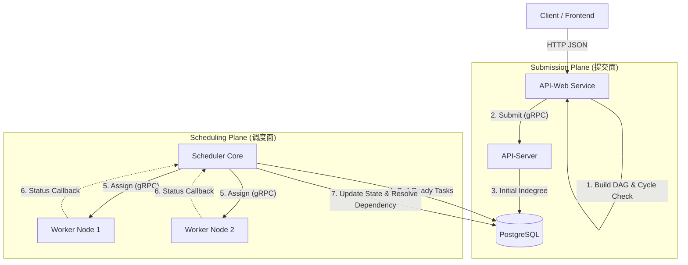
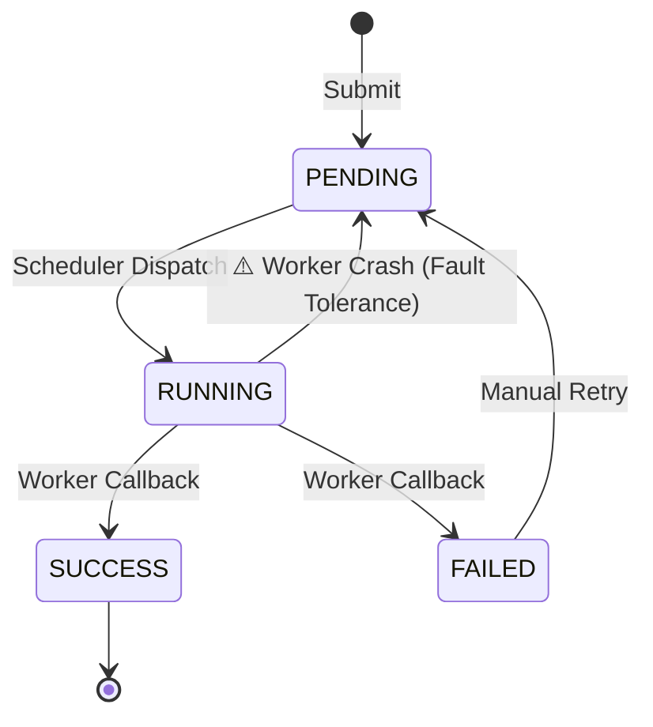

# **Distributed Task Scheduling System (DTS)**

  

一个基于 C++20 微服务架构的高可用分布式任务调度系统，支持 DAG 任务依赖编排、Fail-Fast 校验与故障自愈。

## **📖 项目简介 (Introduction)**

**DTS (Distributed Task Scheduling System)** 是一个高性能的分布式调度平台原型，旨在解决大规模离线任务调度中的复杂依赖管理与高可用问题。

系统采用分层架构设计，将**接入层 (API-Web)** 与 **逻辑持久层 (API-Server)** 分离。核心通信基于 **gRPC**，支持 **DAG (有向无环图)** 的实时构建与拓扑排序检查。系统利用 **PostgreSQL** 的 ACID 特性保证状态一致性，并通过 Master-Worker 模式实现了从任务提交到执行的全链路高吞吐处理。

## **✨ 核心特性 (Key Features)**

* **分层架构与职责分离**:
    * **API-Web**: 负责请求接入与 **Fail-Fast 校验**。在内存中构建 DAG 并运行拓扑排序/DFS 算法，**直接拦截环路依赖**，防止非法数据污染核心存储。
    * **API-Server**: 专注高吞吐写入与元数据管理，解耦了计算与存储。
* **DAG 依赖编排**: 支持复杂的任务依赖网络，基于 **入度表 (Indegree Table)** 算法实现高效的并行调度。
* **高可用与故障恢复 (Fault Tolerance)**:
    * **心跳保活**: Scheduler 维护 Worker 存活状态，自动剔除僵死节点。
    * **自动重入队 (Requeue)**: 当 Worker 宕机时，其名下 `RUNNING` 任务会被原子性回滚并重新调度，确保**任务零丢失**。
* **高性能通信**: 
    * 任务提交面 (Web -> Server) 和 控制面 (Scheduler <-> Worker) 全链路采用 **gRPC (Protobuf)**。
* **工业级工程实践**: 
    * 基于 `libpqxx` 封装**线程安全连接池**，支持自动断线重连 (Self-Healing)。
    * 使用 Modern CMake (FetchContent) 管理依赖，支持 **Docker Compose** 一键部署。

## **🏗 系统架构 (Architecture)**

### **1\. 微服务拓扑图**



### **2\. 任务状态流转机 (State Machine)**



## **🛠 技术栈 (Tech Stack)**

| 类别 (Category) | 技术 (Technology) |
| :---- | :---- |
| **Language** | C++17/20 (Concepts, Smart Pointers, Lambda) |
| **Network** | gRPC, Protobuf, cpp-httplib |
| **Database** | PostgreSQL 12+ (libpqxx driver, Dynamic Partitioning) |
| **Concurrency** | ThreadPool, std::mutex, std::condition\_variable |
| **Build & Test** | CMake, GoogleTest (GTest), GLog |
| **DevOps** | Docker, Docker Compose |

## **💻 核心实现细节 (Implementation Details)**

### **高性能数据库连接池 (DB Connection Pool)**

为了在高并发场景下复用 TCP 连接，利用 C++ RAII 机制与 std::condition\_variable 实现了线程安全的连接池。  
特别设计了 ExecuteTx 模板方法，封装了事务的开启、提交与异常回滚逻辑，极大降低了业务代码耦合度：
```cpp  
// 事务模板方法 (Simplified)  
void ExecuteTx(const std::function\<void(pqxx::work&)\>& tx\_logic) {  
    auto conn \= AcquireConnection(); // 阻塞式获取连接  
    bool conn\_broken \= false;  
    try {  
        pqxx::work tx(\*conn);  
        tx\_logic(tx); // 执行具体的业务 SQL  
        tx.commit();  
    } catch (const pqxx::broken\_connection& e) {  
        conn\_broken \= true; // 标记连接损坏  
        throw;  
    }   
    // 归还连接 (内部处理断线重连)  
    ReleaseConnection(std::move(conn), conn\_broken);  
}
```

### **故障恢复机制 (Fault Tolerance)**

Scheduler 包含一个 后台巡检线程 (Patrol Thread)，定期检查 Worker 的最后心跳时间。  
一旦发现 Worker 超时（默认 30s），系统将执行以下原子操作：

1. 将该 Worker 标记为 Offline。  
2. 执行 SQL: UPDATE task SET state=PENDING WHERE worker\_id=xxx AND state=RUNNING。  
3. 任务被释放回公共池，等待下一次调度。

## **🚀 快速开始 (Getting Started)**

### **前置要求**

* Linux (Ubuntu 20.04+) or WSL2  
* CMake 3.15+  
* PostgreSQL 12+

### **1\. 编译项目**

mkdir build && cd build  
cmake ..  
make \-j4

### **2\. 启动集群 (Docker 方式)**

(推荐) 无需配置本地环境，一键拉起 PG、Scheduler 和 Worker。

docker-compose up \-d \--build

## **📊 性能表现 (Performance)**

*测试环境：Ultra 7 255HX, 16GB RAM*

| 模块 (Module) | 指标 (Metric) | 数据 (Value) | 说明 |
| :---- | :---- | :---- | :---- |
| API Submission | QPS | 682 | 端到端 DAG 提交与落库 |
| | Avg Latency | 11.65 ms |
| | P99 Latency | 67.62 ms | 长尾延迟主要受 PG 写入影响 |
| Scheduler,Dispatch | QPS | 1207 | 任务分发吞吐量 |
| | Avg Latency | 1.64 ms | 极低的分发延迟 |
| | P99 Latency | 4.00 ms |

## **📅 未来规划 (Performance)**
[ ] 引入 Redis 缓存:

缓存 Worker 心跳数据，减少数据库高频写入压力。

基于 Redis 实现分布式锁，支持 Scheduler 多节点高可用部署。

[ ] 支持 Cron 表达式: 实现定时任务调度功能。

**Author:** \[郝光磊\]