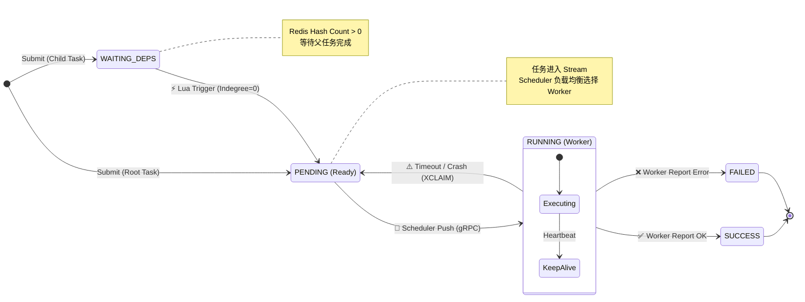

# **Distributed Task Scheduling System (DTS)**

    

一个基于 **C++17 (Core)**与**Go (CLI)**混合架构开发的高性能分布式任务调度系统。采用 Master-Worker 推送模式 与 存算分离 设计，支持大规模 DAG 依赖编排与毫秒级任务流转。

## **📖 项目简介 (Introduction)**

**DTS (Distributed Task Scheduling System)** 旨在解决大规模任务调度中的高并发写入瓶颈与复杂依赖管理问题。

不同于传统的基于数据库轮询的调度系统，DTS 采用 **Active Push** (主动推送) 架构，Master 节点作为大脑主动感知就绪任务并分发给 Worker，实现了精准的负载均衡与流量控制。系统在接入层引入 **Async Group Commit** (异步组提交) 机制，利用双缓冲队列与流式写入技术，成功在单机环境下突破 15,000+ QPS 的吞吐极限。

## **✨ 核心特性 (Key Features)**

* **🚀 极致性能架构 (High-Performance Architecture)**:
    * **Async Group Commit (异步组提交)**: 引入 **双缓冲 (Double Buffering)** 队列与 **Fire-and-Forget** 机制，将单次请求 IO 转化为微批顺序 IO。单机提交吞吐量突破 **20,000+ QPS** (提升 14 倍)。
    * **Claim Check Pattern**: Redis Stream 仅传输轻量级 `TaskID` 凭证，业务负载 (Payload) 存入 Redis KV，极大提升网络带宽利用率。
    * **Split-Phase Submission**: 采用 **"Commit-then-Publish"** 策略，利用 PostgreSQL **COPY 协议** 实现秒级落盘，配合 Redis Pipeline 极速分发。

* **🧩 混合微服务架构 (Hybrid Microservices)**:
    * **Master-Worker Push Model**: 调度器 (Scheduler) 作为“大脑”拥有全局视角，主动推送任务给 Worker。支持精准的负载均衡（基于内存影子状态）与流量整形。
    * **Go Control Plane**: 引入 Go 语言构建高效 CLI，实现 Client-side Fail-Fast (本地 Kahn 算法查环) 与原生高并发压测。

* **Redis 驱动的 DAG 引擎**:
    * **Lua 原子调度**: 任务完成后的依赖检查与下游触发完全在 Redis 端原子执行，消除 C++ 端并发竞争。
    * **Stream 消费**: Scheduler 采用 `XREADGROUP` + `BLOCK` 模式，实现事件驱动的毫秒级响应。

* **高可用与自愈 (Robustness)**:
    * **Write-Behind Persistence**: 任务状态先更新 Redis，再通过 `DbBatcher` 异步批量刷入 DB，平滑数据库压力。
    * **Optimistic Pre-booking**: 调度器在内存中维护 Worker 负载影子状态，实现 **Round-Robin** 精准负载均衡。
    * **Fault Tolerance**: 支持 Worker 动态扩缩容，掉线任务自动重入队 (Requeue)。

## **⚙️ 基础功能 (Basic Features)**

* **复杂的 DAG 任务编排:** 支持多层级、多依赖的任务流定义，自动检测环路依赖 (Cycle Detection)。

* **多语言任务支持:** 接入层与执行层解耦，Worker 可扩展支持 Python/Shell/C++ 等多种任务类型。

* **故障自动恢复:** 完备的心跳检测机制，当 Worker 宕机时，未完成的任务会自动重入队 (Requeue)，保证任务零丢失。

* **Fail-Fast 校验:** 在 API 接入层即可拦截非法请求，保护核心存储。

## **🏗 系统架构 (Architecture)**

### **1. 物理拓扑与数据流**
    系统编译产出 4 个核心二进制文件：dts-portal (接入), dts-scheduler (调度), dts-worker (执行), dts-cli (控制)。

```mermaid
graph TD
    User[User / CLI] -->|1. gRPC Submit (Proto)| Portal[dts-portal]
    
    subgraph "Ingestion Plane (IO Optimized)"
        Portal -->|2. Batch Buffer| Memory[Double Buffer]
        Memory -->|3. COPY Stream| DB[(PostgreSQL)]
        Portal -->|4. Pipeline| Redis[(Redis Stream)]
    end
    
    subgraph "Control Plane (Brain)"
        Redis -->|5. XREADGROUP| Scheduler[dts-scheduler]
        Scheduler -->|6. Lua Script (Indegree Check)| Redis
        Scheduler -- 7. Active Push (gRPC) --> Worker[dts-worker]
    end
    
    subgraph "Execution Plane (Muscle)"
        Worker -->|8. Execute Logic| Sandbox
        Worker -- 9. Report Status --> Scheduler
        Scheduler -->|10. Async Write-Back| DB
    end
```

### **2\. 微服务拓扑图**

```mermaid
graph TD
    %% 样式定义
    classDef client fill:#00ADD8,stroke:#333,stroke-width:2px,color:white;
    classDef server fill:#438dd5,stroke:#333,stroke-width:2px,color:white;
    classDef storage fill:#A61D24,stroke:#333,stroke-width:2px,color:white;

    %% 核心组件节点
    CLI([dts-cli <br> Control Plane]):::client
    Portal[dts-portal <br> Ingestion Gateway]:::server
    Scheduler[dts-scheduler <br> Brain / Push Center]:::server
    Worker[[dts-worker <br> Execution Node]]:::server
    
    %% 存储节点
    DB[(PostgreSQL)]:::storage
    Redis[(Redis Cluster)]:::storage

    %% 1. 提交链路
    CLI -->|1. Submit (gRPC)| Portal
    
    subgraph "Phase 1: Ingestion (IO Optimized)"
        Portal -->|2. Batch Buffer & COPY| DB
        Portal -->|3. Pipeline (Meta + DAG)| Redis
    end
    
    subgraph "Phase 2: Control & Push"
        Redis -.->|4. XREADGROUP (Events)| Scheduler
        Scheduler -->|5. Lua Script (Atomic Check)| Redis
        Scheduler -- "6. Active Push (gRPC)" --> Worker
    end
    
    subgraph "Phase 3: Execution & Feedback"
        Worker -->|7. Execute Logic| Worker
        Worker -- "8. Report Status" --> Scheduler
        Scheduler -.->|9. Async Write-Back| DB
    end
```

### **3\. 任务状态流转机 (State Machine)**



### **2. 核心组件交互**

1. **API Server**: 接收请求 -> `COPY` 写入 DB -> `Commit` -> `Pipeline` 写入 Redis (Meta + Stream)。
    
2. **Scheduler**: `XREADGROUP` 拉取任务 -> 负载均衡选择 Worker -> gRPC 下发。
    
3. **Worker**: 执行业务逻辑 -> RPC 汇报 `SUCCESS/FAILED`。
    
4. **Feedback Loop**: Scheduler 收到汇报 -> 执行 Lua 脚本 (减依赖/触发子任务) -> `DbBatcher` 攒批落盘。

## **🛠 技术栈 (Tech Stack)**

| **类别**          | **技术方案**           | **核心作用**                                   |
| --------------- | ------------------ | ------------------------------------------ |
| **Language**    | **C++17/20**          | Concepts, Coroutines, Smart Pointers       |
| **Middleware**  | **Redis 7.0**      | Stream (队列), Lua (逻辑), Hash (状态), Pipeline |
| **Storage**     | **PostgreSQL 15**  | `libpqxx` (stream_to COPY 协议), ACID 事务     |
| **RPC**         | **gRPC**           | Protobuf 零拷贝通信                             |
| **Concurrency** | ThreadPool, Atomic | Lock-free 计数器, 细粒度锁                        |
| **DevOps**      | Docker Compose     | 一键拉起 20+ Worker 集群进行压测                     |

## **💻 核心实现细节 (Implementation Details)**

### **1. 基于 Lua 的原子 DAG 引擎 (Atomic DAG Engine via Lua)**

为了消除调度器与数据库的高频交互延迟，我们将 DAG 的核心流转逻辑下沉至 Redis 端。 编写了专门的 Lua 脚本，利用 Redis 的**单线程原子性**特性，实现了 "Check-and-Trigger" 的原子操作，避免了应用层的并发锁竞争。

```Lua
-- scripts/complete_task.lua (Core Logic)
-- 1. 获取当前任务的所有子节点
local children = redis.call('SMEMBERS', KEYS[1]) 

for _, child_id in ipairs(children) do
    -- 2. 原子递减子任务的入度 (Indegree)
    local remain = redis.call('HINCRBY', KEYS[2], child_id, -1)
    
    -- 3. 若入度归零，立即触发调度
    if remain == 0 then
        -- 获取元数据 payload 并推入 Stream
        local payload = redis.call('GET', "dts:task:meta:" .. child_id)
        redis.call('XADD', KEYS[3], '*', 'payload', payload, 'task_id', child_id)
    end
end
```

### **2. Proto-First 透传 ( Pass-through)**

在旧架构中，`JSON Parsing` 占用了 API Server 40% 的 CPU。 新架构采用了 **"Payload 不落地"** 策略。客户端传入的 `func_params` 在 Protobuf 定义中被声明为 `string` (bytes)，而非结构化对象。

- **Ingestion**: API Server 接收请求后，直接将二进制数据写入 PostgreSQL (`COPY`) 和 Redis (`SET`)，全程无反序列化开销。
    
- **Execution**: 只有 Worker 在最终执行前才会解析业务参数。
    
- **收益**: 这种设计使得 API Server 的吞吐量不再受限于业务数据的复杂度，仅受限于网络带宽。
    

### **3. 乐观预订负载均衡 (Optimistic Pre-booking)**

为了解决分布式环境下的“状态滞后”导致的热点 Worker 问题（即所有任务都发给了同一个汇报为空闲的 Worker），调度器实现了一套**内存影子状态**机制。

1. **Pre-book**: 调度器决定分发任务前，先在本地内存的 `WorkerLoadMap` 中预增加该 Worker 的负载计数。
    
2. **Dispatch**: 执行 RPC 分发。
    
3. **Correction**: 当收到 Worker 的真实心跳或任务结束回调时，再修正为准确值。
    

这一机制强制实现了 **Round-Robin** 级别的精准分发，在压测中将各 Worker 的负载误差控制在 **±1** 以内。

### **4. 基于 Stream 的故障自愈 (Stream-based Fault Tolerance)**

系统利用 Redis Stream 的 `PEL` (Pending Entries List) 实现了可靠的任务追踪。

- **ACK 机制**: 只有当 Worker 明确汇报 `SUCCESS/FAILED` 后，Scheduler 才会执行 `XACK`。
    
- **Rescue 线程**: 后台线程定期扫描 `XPENDING` 列表，找出 `idle_time > 60s` 的任务（意味着 Worker 宕机或网络中断）。
    
- **XCLAIM**: 使用 `XCLAIM` 原子性地抢占这些僵尸任务的所有权，并重新分发给健康的 Worker，确保**任务零丢失**。

### **5. 客户端 Fail-Fast 机制 (Client-side Optimization)**
为了防止死循环依赖（Cycle）浪费服务端宝贵的计算与存储资源，我们在 Go CLI 端实现了前置校验。

图算法移植: 使用 Go 语言复现了 Kahn's Algorithm (拓扑排序)。

本地拦截: 用户提交 YAML 时，CLI 在本地构建图结构。一旦检测到环，直接拒绝提交，实现了 0 网络开销 的错误拦截。

## **📊 性能表现 (Performance)**

*测试环境：Intel Ultra 7 255HX (24 Cores), 16GB RAM, Docker Compose Cluster*

我们对系统进行了**控制变量法**压测，分别测试了在不同架构模式下的极限吞吐量：

| 架构模式 | 场景 | QPS / TPS | 平均延迟 | 瓶颈分析 |
| :--- | :--- | :--- | :--- | :--- |
| **Async Group Commit**<br>*(当前架构)* | **API Ingestion** | **21,500+** | **~50ms**<br>*(Batch Window)* | **CPU (序列化/UUID)**<br>已彻底突破 IO 瓶颈，性能主要受限于 CPU 计算能力。 |
| **Sync Commit**<br>*(旧版架构)* | API Ingestion | 1,627 | 9.77ms | **Disk IOPS**<br>受限于 PostgreSQL WAL 同步落盘的物理极限。 |
| **Scheduler** | Task Dispatch | 4800+ | 1.64ms | 调度能力，性能瓶颈在于DbBatcher的写入 |


> **性能总结**: 通过引入异步组提交与双缓冲机制，系统写入吞吐量提升了 **14倍**，成功将性能瓶颈从 **IO 等待** 转移到了 **CPU 计算**，压榨出了硬件的物理极限。

## **🚀 快速开始 (Getting Started)**

### **前置要求**

* Linux (Ubuntu 20.04+) or WSL2  
* CMake 3.15+  
* PostgreSQL 12+

### **1\. 编译项目**

mkdir build && cd build
cmake .. -DCMAKE_BUILD_TYPE=Release
make -j$(nproc)

### **2\. 启动集群 (Docker 方式)**

(推荐) 无需配置本地环境，一键拉起 PG、Scheduler 和 Worker。

docker-compose up -d --build --scale worker=20

### **3. 运行压测**

Bash

```
cd src/dts-cli

go run main.go bench -c 10 -n 1000
```

**Author:** \[郝光磊\]